# Manual de usuario — Plataforma de Herramientas BEX

**Para uso diario en el navegador**  
**Empresa:** BEX · **Idioma:** Español  
**Última actualización:** Mayo 2026

---

## Tabla de contenidos

1. [¿Qué es esta plataforma?](#1-qué-es-esta-plataforma)
2. [Antes de empezar](#2-antes-de-empezar)
3. [Entrar a la plataforma](#3-entrar-a-la-plataforma)
4. [Conocer la pantalla principal](#4-conocer-la-pantalla-principal)
5. [Comparador de Datos](#5-comparador-de-datos)
6. [Normalizador RUT](#6-normalizador-rut)
7. [Normalizador de Textos](#7-normalizador-de-textos)
8. [Mis Capacitaciones](#8-mis-capacitaciones)
9. [Enlaces de interés](#9-enlaces-de-interés)
10. [Calendario y tareas](#10-calendario-y-tareas)
11. [Generador de Cargas (Moodle)](#11-generador-de-cargas-moodle)
12. [Preguntas frecuentes](#12-preguntas-frecuentes)
13. [¿Necesitas ayuda?](#13-necesitas-ayuda)

---

## 1. ¿Qué es esta plataforma?

La **Plataforma de Herramientas BEX** es un sitio web interno donde puedes hacer tareas habituales sin instalar programas en tu computador. Todo se hace desde el navegador (Chrome, Edge o Firefox).

### ¿Para qué sirve?

| Herramienta en el menú | En palabras simples |
|------------------------|---------------------|
| **Comparador de Datos** | Compara dos planillas Excel y te entrega un reporte con diferencias o coincidencias |
| **Normalizador RUT** | Deja todos los RUT con el mismo formato |
| **Normalizador Textos** | Pasa listas de texto a MAYÚSCULAS, minúsculas o formato título |
| **Capacitaciones Mod 1** | Guarda tus capacitaciones (título, enlace, notas, fecha) |
| **Enlaces de Interes** | Guarda enlaces útiles por empresa |
| **Calendario & Tareas** | Agenda tareas por día y, si lo configuras, recibe recordatorio por correo |
| **Generador de Cargas** | Crea archivos CSV para cargar usuarios en Moodle desde un Excel de dotación |

> **Importante:** No todos ven las mismas opciones en el menú. Tu jefe o el área de sistemas define qué herramientas puedes usar. Si falta alguna, pídeles que te la habiliten.

---

## 2. Antes de empezar

### Lo que necesitas

- Un **usuario** y **contraseña** que te entregue tu administrador o jefe de área.
- La **dirección web** de la plataforma (un enlace que suele verse así: `https://…vercel.app` o similar).
- Un navegador actualizado (Chrome, Edge o Firefox).

### Consejos generales

- No compartas tu contraseña con otras personas.
- Si trabajas con archivos Excel, tenlos listos en tu PC antes de subirlos.
- Al terminar tu jornada, usa **Cerrar Sesión** (abajo en el menú izquierdo).

---

## 3. Entrar a la plataforma

### Paso a paso

1. Abre el enlace que te dieron (márcalo en favoritos para encontrarlo rápido).
2. Escribe tu **Usuario**.
3. Escribe tu **Contraseña**.
4. Haz clic en **Iniciar Sesión**.

Si los datos son correctos, entrarás a la primera herramienta del menú (normalmente el **Comparador de Datos**).

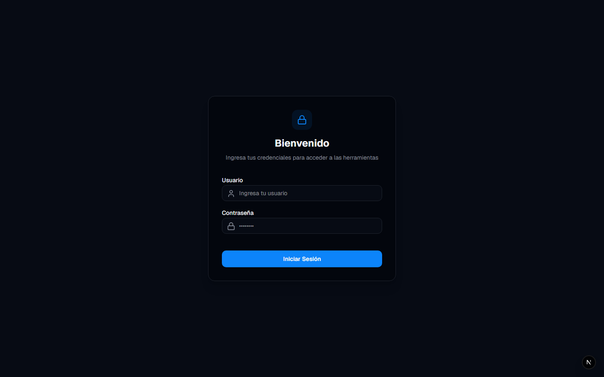

### Si no puedes entrar

| Situación | Qué hacer |
|-----------|-----------|
| Mensaje de usuario o contraseña incorrectos | Revisa que no tengas espacios de más; vuelve a escribir con cuidado |
| Olvidaste la contraseña | Pide a tu administrador o a sistemas que te la restablezcan |
| La página no carga | Prueba otro navegador o avisa a sistemas |

---

## 4. Conocer la pantalla principal

### Menú de la izquierda

En el costado izquierdo verás el menú **Herramientas**. Cada ícono lleva a una herramienta. La opción en la que estás se resalta en color.

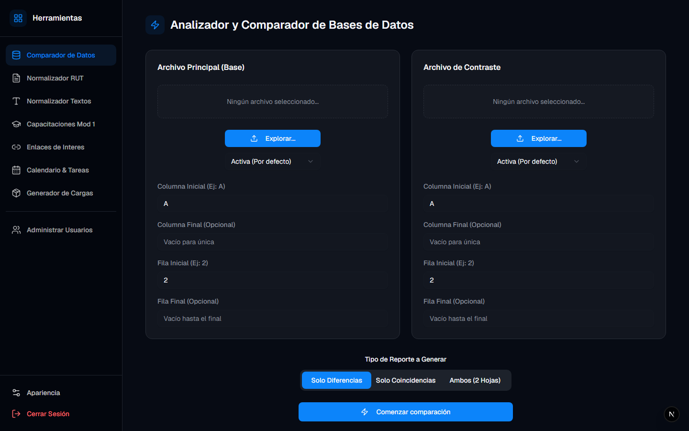

### Cambiar colores (modo claro/oscuro y estilo)

1. Abajo del menú, haz clic en **Apariencia**.
2. Elige **Claro** u **Oscuro**.
3. Elige un **estilo visual** (Océano, Aurora, Bosque, etc.).
4. El navegador recordará tu preferencia la próxima vez que entres.

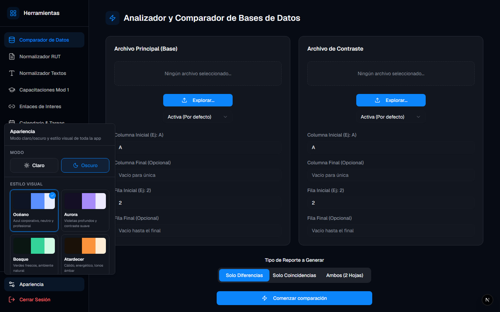

### Salir de forma segura

- Haz clic en **Cerrar Sesión** (botón rojo al final del menú).

---

## 5. Comparador de Datos

### ¿Qué hace?

Compara **dos archivos Excel** y te descarga un nuevo Excel con el resultado: solo lo que cambió, solo lo que coincide, o ambos en hojas separadas.

### Cuándo usarlo

- Tienes una base “oficial” y otra lista que quieres contrastar (por ejemplo, nómina vs. asistencia).
- Necesitas ver quién está en un archivo y no en el otro.

### Paso a paso

#### 1. Subir los dos archivos

1. En el menú, entra a **Comparador de Datos**.
2. En **Archivo Principal (Base)**, haz clic y elige el primer Excel.
3. En **Archivo de Contraste**, elige el segundo Excel.

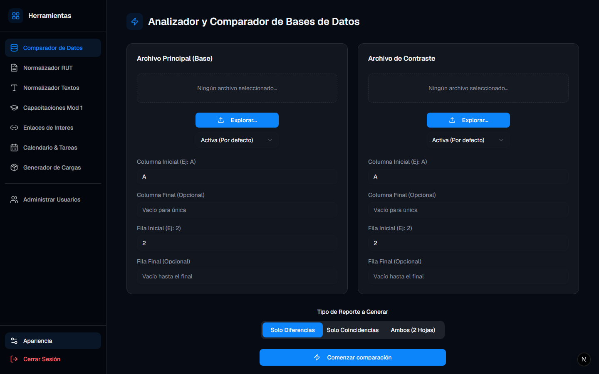

#### 2. Indicar qué parte del Excel comparar

En cada tarjeta puedes ajustar:

| Campo | Significado sencillo |
|-------|----------------------|
| **Columna inicio / fin** | Letras de columnas a comparar (ej. de la A a la C) |
| **Fila inicio** | Desde qué fila empiezan los datos (casi siempre **2** si la fila 1 son títulos) |
| **Fila fin** | Hasta qué fila (déjalo vacío para usar todo el archivo) |
| **Hoja** | Pestaña del Excel; si no sabes cuál, deja *Activa (Por defecto)* |

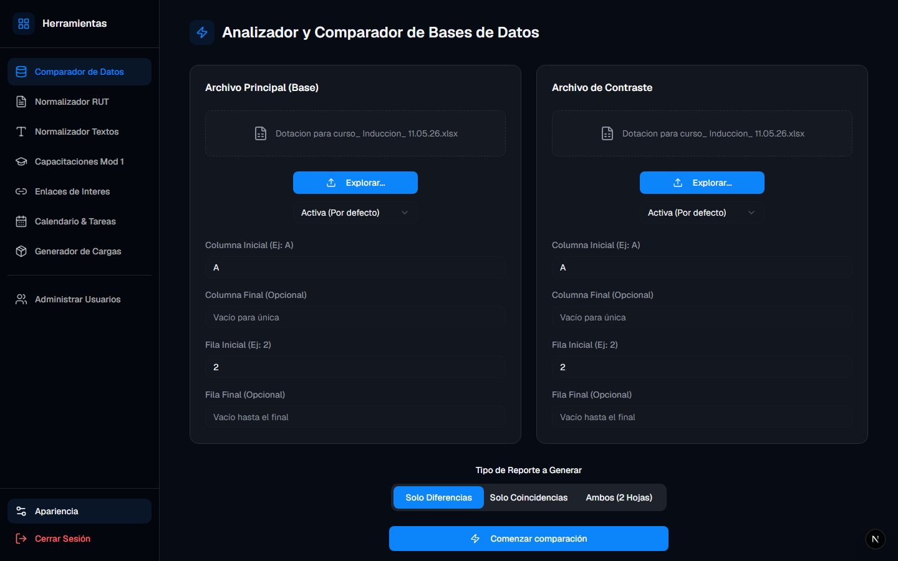

#### 3. Elegir el tipo de reporte

- **Solo Diferencias:** lo que no coincide entre ambos archivos.
- **Solo Coincidencias:** lo que aparece en los dos.
- **Ambos (2 Hojas):** un archivo con las dos cosas en pestañas distintas.

#### 4. Ejecutar y descargar

1. Haz clic en **Comenzar comparación**.
2. Espera unos segundos (verás que está procesando).
3. Se descargará solo un archivo Excel con nombre tipo `Reporte_…xlsx`. Ábrelo con Excel.

### Consejos

- Usa la **misma columna clave** en ambos archivos (por ejemplo, RUT o código en la columna A).
- Los textos se comparan **sin distinguir mayúsculas y minúsculas**.
- Si el archivo es muy pesado y falla, avisa a sistemas.

---

## 6. Normalizador RUT

### ¿Qué hace?

Toma una lista de RUT (uno por línea) y los deja todos con el **mismo formato**.

### Paso a paso

1. Menú → **Normalizador RUT**.
2. En el cuadro de la izquierda, pega o escribe un RUT por línea.
3. Elige cómo quieres el resultado:
   - Formato normalizado
   - Sin puntos y con guión (`12345678-9`)
   - Sin puntos ni guión (`123456789`)
4. Si quieres la **K en minúscula**, marca la casilla correspondiente.
5. Clic en **Normalizar**.
6. A la derecha verás el resultado; usa **Copiar** para pegarlo en Excel u otro programa.

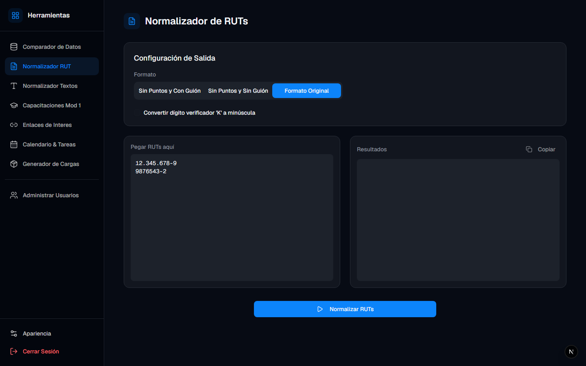

---

## 7. Normalizador de Textos

### ¿Qué hace?

Transforma una lista de textos (una línea por registro) a **MAYÚSCULAS**, **minúsculas** o **Formato Título** (Primera Letra En Mayúscula).

### Paso a paso

1. Menú → **Normalizador Textos**.
2. Pega tu lista en el cuadro izquierdo.
3. Elige el formato deseado.
4. Clic en **Normalizar** y copia el resultado de la derecha.

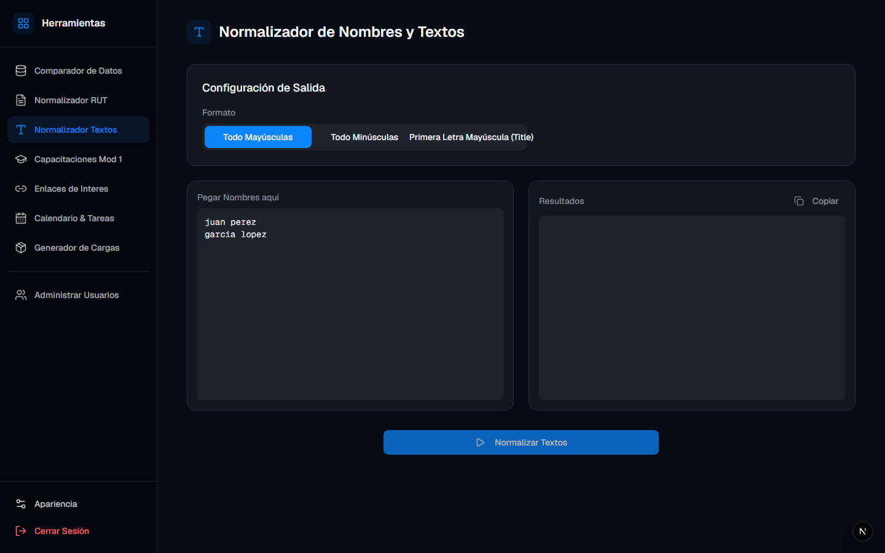

---

## 8. Mis Capacitaciones

### ¿Qué hace?

Es tu **agenda personal de capacitaciones**: guardas título, enlace al video o curso, duración, notas y fecha. Solo tú ves las entradas que creas con tu usuario.

### Ver el listado

1. Menú → **Capacitaciones Mod 1**.
2. Usa el buscador si tienes muchas entradas.
3. La tabla muestra todo lo que has guardado.

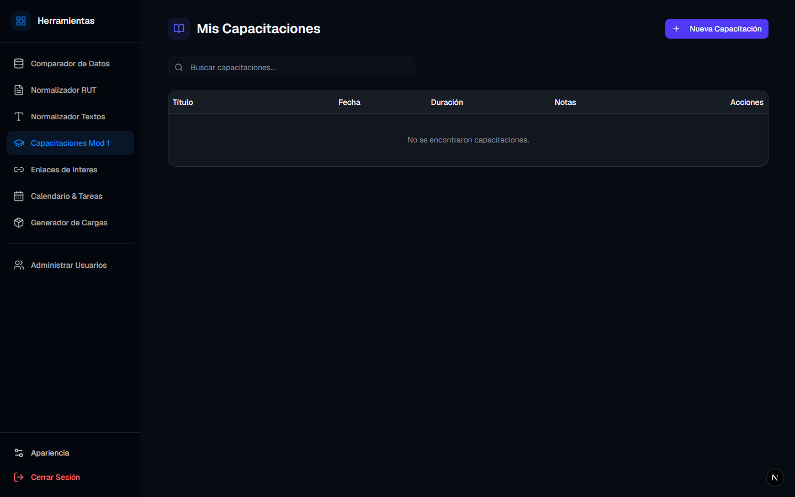

### Agregar una capacitación

1. Clic en **Nueva Capacitación**.
2. Completa al menos el **Título**; el resto es opcional pero recomendable (URL, duración, notas, fecha).
3. Guarda el formulario.

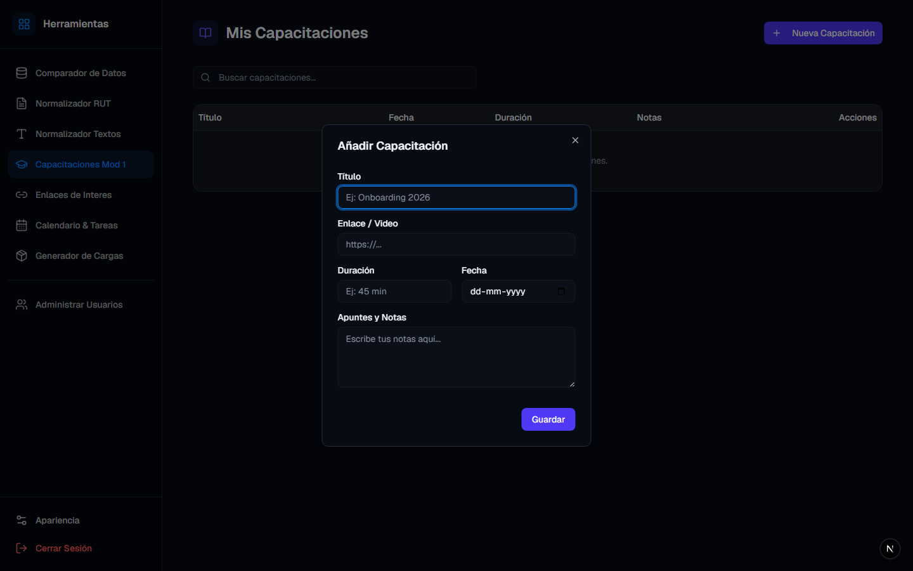

### Eliminar

- En la fila que quieras borrar, usa el icono de **papelera** y confirma.

---

## 9. Enlaces de interés

### ¿Qué hace?

Guarda enlaces web útiles (portales, documentos, sistemas) y los organiza por **empresa** para encontrarlos rápido.

### Paso a paso

1. Menú → **Enlaces de Interes**.
2. Filtra por empresa o busca por texto.
3. Para agregar: abre el formulario de **nuevo enlace**, escribe título, dirección web (URL), empresa y notas si quieres.
4. Para abrir un enlace guardado: usa el icono que abre la página en una pestaña nueva.
5. Para cambiar o borrar: usa los iconos de editar o eliminar en cada tarjeta.

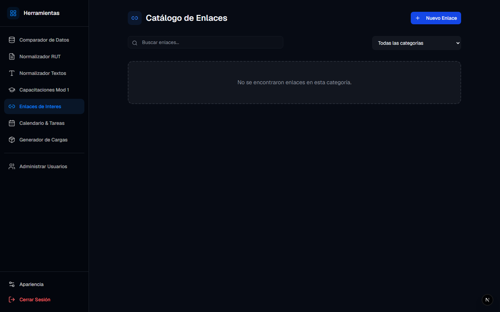

Cada empresa tiene un color de borde distinto para reconocer las tarjetas de un vistazo.

---

## 10. Calendario y tareas

### ¿Qué hace?

Te permite **anotar tareas por día** en un calendario, marcarlas como hechas y, si configuras el correo, recibir un aviso por email.

### Ver el calendario

- Flechas **<** y **>** cambian de mes.
- Los días con tareas muestran números:
  - **Naranja:** pendientes
  - **Verde:** completadas
- Haz clic en un día para ver sus tareas a la derecha.

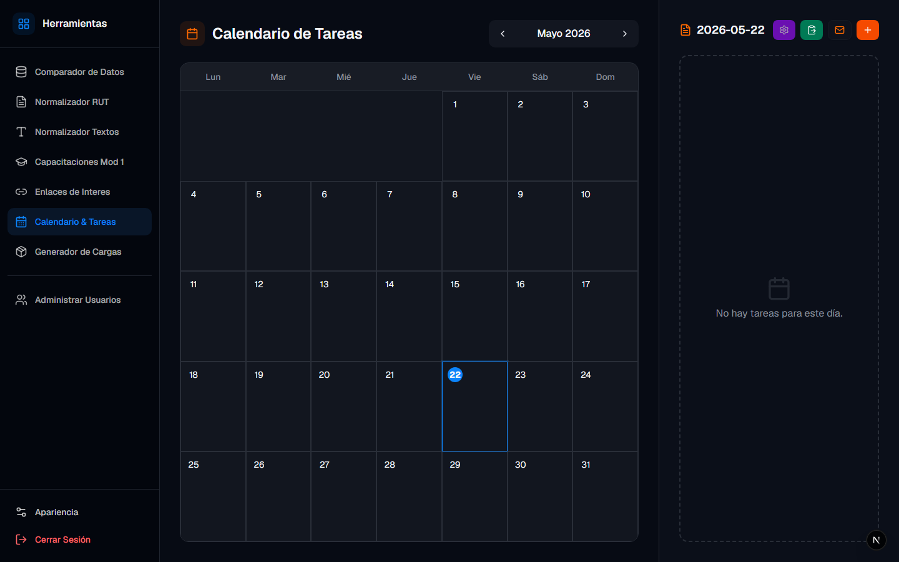

### Crear una tarea

1. Elige el día en el calendario.
2. Clic en **Nueva Tarea**.
3. Escribe al menos el **Título**. Puedes agregar detalle, curso, grupo, ruta de carpeta, etc.
4. En **Correo notificación** puedes poner el email que debe recibir el aviso ese día.
5. Guarda.

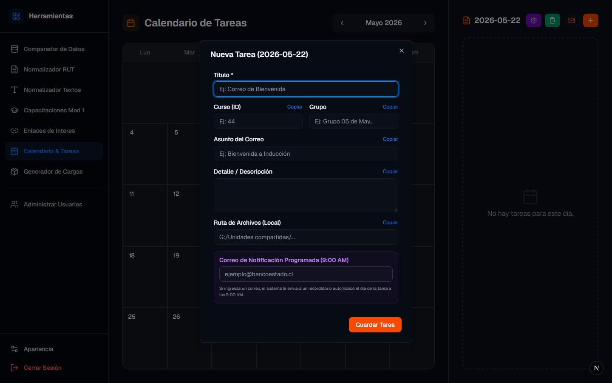

### Marcar como hecha

- Haz clic en el círculo al lado de la tarea para alternar entre pendiente y completada.

### Importar muchas tareas desde Excel

1. Copia en Excel dos columnas: **Día** y **Tarea**.
2. En la plataforma, clic en **Importar desde Excel** y pega los datos.
3. Revisa fila por fila en el asistente antes de confirmar.

### Recibir recordatorios por correo (opcional)

Si tu área usa el envío automático de correos:

1. En la parte superior del módulo, abre **Configuración SMTP** (icono de correo/configuración).
2. Completa los datos que te entregue sistemas (servidor, puerto, usuario, contraseña de aplicación, remitente).
3. Guarda.

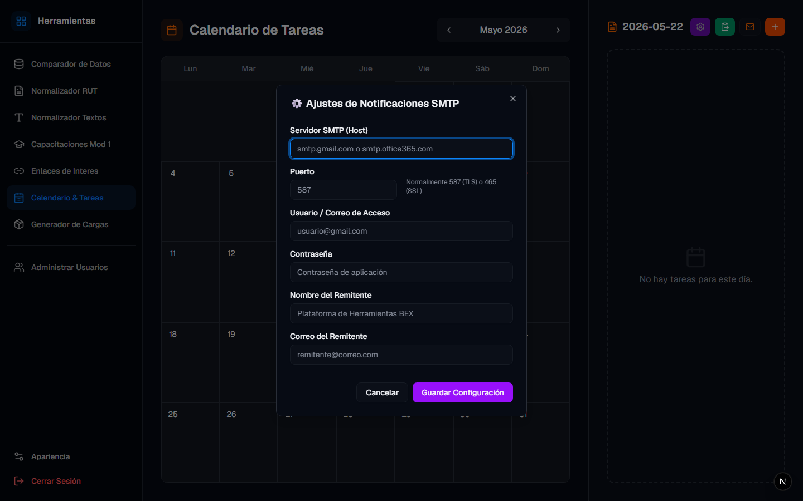

> Si no configuras el correo, igual puedes usar el calendario; solo no recibirás avisos automáticos.

---

## 11. Generador de Cargas (Moodle)

### ¿Qué hace?

Convierte un **Excel de dotación** (lista de personas) en archivos **CSV listos para subir a Moodle**, separados por perfil o departamento. La plataforma también cruza los cursos según una matriz interna que mantiene sistemas.

### Qué necesitas tener

- Permiso para ver **Generador de Cargas** en el menú.
- El archivo Excel de dotación con **títulos en la primera fila**.
- Saber qué columna indica el **perfil o departamento** de cada persona (debe coincidir con los nombres que usa tu empresa en la matriz de cursos).

### Los 4 pasos del asistente

---

#### Paso 1 — Subir el Excel

1. Menú → **Generador de Cargas**.
2. Arrastra el archivo o haz clic en la zona punteada para buscarlo en tu PC.
3. Cuando cargue, pasarás solo al paso 2.

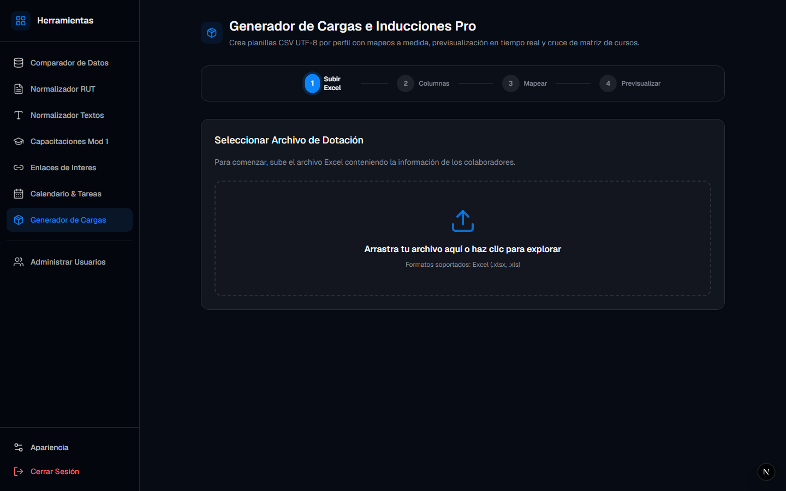

---

#### Paso 2 — Elegir hoja y columnas

1. Selecciona la **pestaña (hoja)** del Excel que quieres usar.
2. Marca las **columnas** que deben salir en el archivo final (datos de Moodle).
3. Para ir más rápido, usa **Usar Recomendadas Moodle** (selecciona los campos más usados).
4. Clic en **Configurar Mapeo** para continuar.

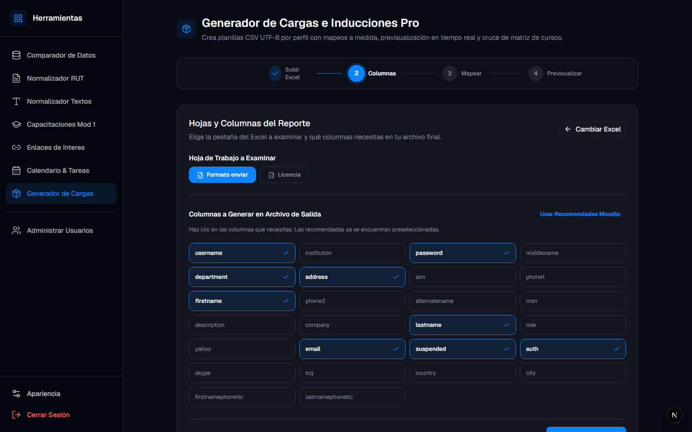

---

#### Paso 3 — Relacionar columnas y nombre del grupo

1. Escribe el **Nombre del Grupo de Inducción** (ej. `Grupo Inducción Mayo 2026`). Ese nombre se repetirá en los cursos del grupo.
2. Para cada columna de salida, indica:
   - De qué **columna del Excel** sale el dato, o
   - Un **valor fijo** que será igual para todos (por ejemplo, tipo de acceso o “usuario activo”).
3. Revisa bien el campo de **departamento/perfil**: debe coincidir con cómo están nombrados los perfiles en la matriz de cursos.
4. Puedes usar **Previsualizar 10 Filas** para ver una muestra antes de generar todo.

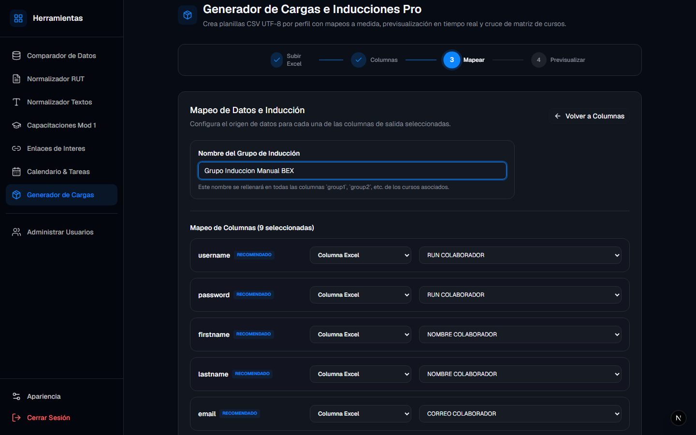

**La plataforma ajusta automáticamente algunos campos habituales:**

| Campo | Qué hace |
|-------|----------|
| Usuario / contraseña | Suele tomar el RUT sin puntos ni guión |
| Nombre, apellido, email, departamento | Los pasa a MAYÚSCULAS |
| Tipo de acceso y “suspendido” | Muchas veces van con valores fijos que define tu área |

---

#### Paso 4 — Revisar y descargar

1. Revisa las primeras filas de cada perfil en las pestañas.
2. Si está correcto, clic en **Generar ZIP Completo**.
3. Se descargará un archivo `.zip` con un CSV por cada perfil. Ábrelos con Excel; usan **punto y coma** como separador (formato habitual en Chile).

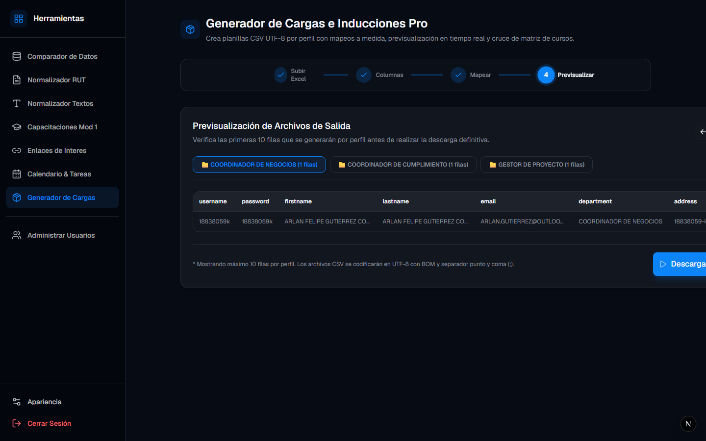

### Si algo sale mal

| Mensaje o problema | Qué revisar |
|------------------|-------------|
| No aparecen cursos para un perfil | El nombre del departamento en el Excel no coincide con la matriz; consulta con quien administra la matriz |
| No se generó ningún archivo | Falta mapear usuario/RUT o hay filas vacías |
| El ZIP no se descarga | Vuelve a intentar; si persiste, avisa a sistemas con captura de pantalla |

---

## 12. Preguntas frecuentes

| Pregunta | Respuesta |
|----------|-----------|
| ¿Por qué no veo una herramienta en el menú? | Tu usuario no tiene permiso para esa herramienta. Pide habilitación a tu jefe o a sistemas. |
| ¿Mis capacitaciones y enlaces los ven otros? | Cada usuario ve lo que guarda con su cuenta, salvo que en el futuro se comparta de otra forma. |
| ¿Puedo usar la plataforma desde el celular? | Funciona en navegador móvil, pero es más cómoda en computador por los archivos Excel. |
| ¿Se guarda solo al hacer clic en guardar? | Sí. Si cierras el navegador sin guardar un formulario abierto, puedes perder lo que no guardaste. |
| ¿Cambio de contraseña? | Por ahora debe hacerlo un administrador desde **Administrar Usuarios** (solo personal autorizado). |
| ¿El comparador modifica mis archivos originales? | No. Solo lee los que subes y te entrega un archivo nuevo de resultado. |

---

## 13. ¿Necesitas ayuda?

| Tipo de ayuda | A quién contactar |
|---------------|-------------------|
| Usuario, contraseña o falta una herramienta en el menú | Administrador de tu área o mesa de ayuda / sistemas |
| Enlace web de la plataforma | El mismo contacto que te dio el acceso inicial |
| Matriz de cursos o archivos del generador | Responsable de capacitación o sistemas |
| Correos de recordatorio que no llegan | Sistemas (revisión de configuración SMTP) |

---

*Manual con capturas de pantalla incluidas. Versión PDF: `Manual_Usuario_Plataforma_BEX.pdf` en esta misma carpeta.*
